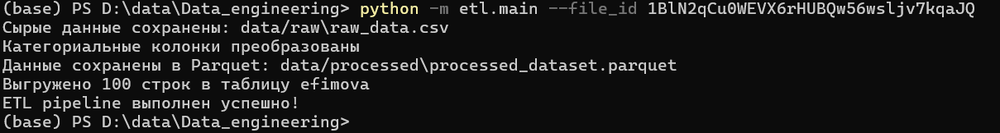

# Data_engineering
Ссылка на датасет, выложенный на Google Drive https://drive.google.com/file/d/1BlN2qCu0WEVX6rHUBQw56wsljv7kqaJQ/view?usp=drive_link

# IBM HR Analytics: Employee Attrition & Performance

**Описание:**
Датасет содержит данные о сотрудниках IBM с целью анализа текучести и производительности. Содержит ~1470 записей и 35 признаков, включая возраст, доход, удовлетворённость работой, стаж, переработки и др. Целевая переменная — Attrition (ушёл ли сотрудник).

**Задачи проекта:**

- Предсказание ухода сотрудников (классификация)
- Анализ факторов риска текучести
- Сегментация сотрудников по уровню риска
- Генерация HR-инсайтов для удержания персонала

**Ключевые факторы влияния на уход:**

- Сверхурочные (OverTime)
- Уровень дохода (MonthlyIncome)
- Удовлетворённость работой (JobSatisfaction)
- Стаж и продвижение (YearsAtCompany, YearsInCurrentRole)
- Расстояние до работы (DistanceFromHome)

**Особенности датасета:**

- Чистый, без пропусков
- Несбалансированная целевая переменная (~16% уходов)
- Идеален для обучения ML и HR-аналитике

**Ограничения:**

- Малый размер выборки (~1470 записей)
- Класс уходов несбалансирован
- Факторы внешней среды и динамика времени не учитываются

# Структура проекта
```
Data_engineering/
├── api_example/                   # Примеры работы с API
│   ├── README.md                  # Описание работы с API
│   ├── api_reader.py              # Скрипт для чтения данных из API
│   └── breweries.csv              # Пример CSV для тестирования API
├── etl/                           # Пакет ETL (Extract, Transform, Load)
│   ├── __init__.py                # Делает папку пакетом Python
│   ├── extract.py                 # Загрузка исходных данных, базовая валидация, сохранение raw CSV
│   ├── transform.py               # Трансформации данных (например, приведение типов)
│   ├── load.py                    # Сохранение данных в Parquet и выгрузка до 100 строк в БД
│   ├── validate.py                # Опциональная валидация данных
│   └── main.py                    # CLI-интерфейс ETL pipeline
├── images/                        # Изображения для проекта
│   ├── Images01.png
│   ├── Images02.png
│   ├── Images03.png
│   ├── Images04.png
│   ├── Images05.png
│   ├── images_1.jpg
│   └── images_2.png
├── notebooks/                     # Jupyter ноутбуки
│   ├── .gitkeep                   # Заглушка, чтобы папка не была пустой
│   ├── EDA.ipynb                  # Исследовательский анализ данных
│   └── README.md                  # Описание ноутбуков и их содержания
├── src/                           # Дополнительный код проекта
│   ├── .gitkeep                   # Заглушка для пустой папки
│   ├── code_for_csv_file.py       # Скрипт для работы с CSV
│   └── write_to_db.py             # Скрипт для загрузки в БД
├── .gitignore                     # Игнорируемые файлы и папки 
├── README.md                      # Основной README проекта
├── environment.yml                # Описание Conda окружения
├── poetry.lock                    # Lock-файл для poetry
├── pyproject.toml                 # Конфигурация Poetry/проекта
└── requirements.txt               # Список зависимостей Python 
```

# Руководство по запуску
1. **Подготовка окружения**

Убедитесь, что ваше окружение data-eng активно:
```powershell
conda activate data-eng
```
2. **Установка необходимых компонентов**

Используйте Poetry для установки всех зависимостей проекта:
```powershell 
poetry install
```
3. **Настройка переменных**

Этот шаг требуется только при первом запуске.
Установите FILE_ID для доступа к данным:
```powershell 
conda env config vars set FILE_ID=1BlN2qCu0WEVX6rHUBQw56wsljv7kqaJQ
```
После этого повторно активируйте окружение, чтобы изменения вступили в силу:
```powershell
conda activate data-eng
```
4. **Запуск скрипта**

Теперь вы можете запустить скрипт загрузки данных:
```powershell
poetry run python data_loader.py
```
# Первые 10 строк даты


# Схема данных после предобработки (Dtypes)

Ниже представлена выдача типов данных (dtypes) DataFrame, подтверждающая успешное преобразование категориальных столбцов:

```python
Attrition                 category
BusinessTravel            category
DailyRate                    int64
Department                category
Education                    int64
EducationField            category
Gender                    category
HourlyRate                   int64
JobInvolvement               int64
JobLevel                     int64
JobRole                   category
MaritalStatus             category
MonthlyIncome                int64
MonthlyRate                  int64
NumCompaniesWorked           int64
OverTime                  category
PercentSalaryHike            int64
PerformanceRating            int64
RelationshipSatisfaction     int64
StockOptionLevel             int64
TotalWorkingYears            int64
TrainingTimesLastYear        int64
WorkLifeBalance              int64
YearsAtCompany               int64
YearsInCurrentRole           int64
YearsSinceLastPromotion      int64
YearsWithCurrManager         int64
dtype: object
```

## EDA

Для подробного анализа данных, выполненного в Jupyter Notebook, вы можете просмотреть его в nbviewer:

[Просмотреть EDA.ipynb в nbviewer](https://nbviewer.org/github/Efimova26/Data_engineering/blob/main/notebooks/EDA.ipynb)

## ETL Package

Пакет etl предназначен для автоматизации процесса извлечения, преобразования и загрузки данных (ETL):

- **extract.py** — загрузка исходных данных из CSV и проверка их целостности; сохранение raw-данных в data/raw.
- **transform.py** — приведение типов колонок и другие базовые трансформации.
- **load.py** — сохранение обработанных данных в формате Parquet (data/processed) и загрузка первых 100 строк в базу PostgreSQL.
- **validate.py** — опциональные проверки корректности данных.
- **main.py** — собирает все шаги ETL в единый пайплайн и предоставляет CLI-интерфейс для запуска.

Пакет упрощает повторное использование кода и стандартизирует процесс подготовки данных.

## Запуск ETL-пакета

Для запуска пайплайна используйте команду:
```powershell
python -m etl.main --file_id 1BlN2qCu0WEVX6rHUBQw56wsljv7kqaJQ
```



После выполнения:

- Сырые данные сохраняются в data/raw/raw_data.csv.
- Обработанные данные сохраняются в data/processed/processed_dataset.parquet.
- Первые 100 строк загружаются в базу PostgreSQL.
